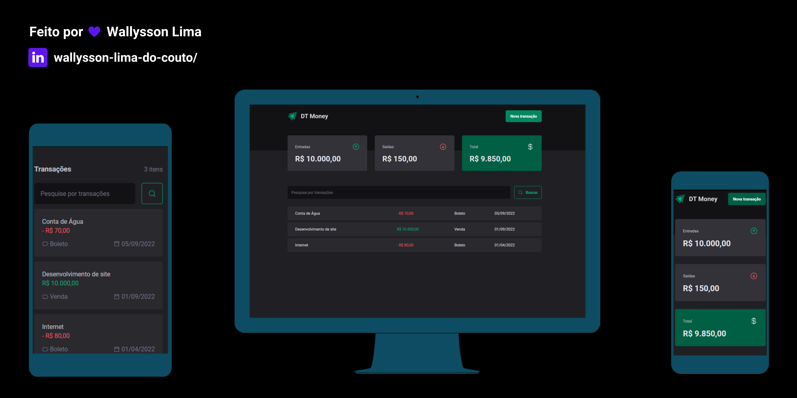

  

# 💻 New dtMoney - Aula 02 Ignite (@Rockeseat)

Subir um server json na porta 3333 e consumir os dados através de uma api ficticia, usando conceitos como:
- Estados
- ContextAPI
- useEffect
- useMemo
- Listas e chaves no ReactJS
- useMediaQuery
- Json Server
- <a href="https://www.figma.com/file/gp38pKsuMSFwt8qPAc4ZEk/DT-Money-(Community)" target="_blank">Layout Figma</a>

# 🚀 Tecnologias

- [ReactJS](https://reactjs.org/)
- [StyledComponents](https://styled-components.com/)
- [Typescript](https://www.npmjs.com/package/typescript)
- [json-server](https://www.npmjs.com/package/json-server)
- [phosphor-react](https://phosphoricons.com/)
- [react-responsive](https://www.npmjs.com/package/react-responsive)

# 📑 Desafios

- Listagem de transações através de uma api ficticia ✔️
- Consumir os dados de uma api ✔️
- Adicionar uma nova transação ✔️
- Sumário com total de entrada, saída e total ✔️
- Responsividade na tabela ✔️

# Previews

  

    <figure>
      
    </figure>
  

